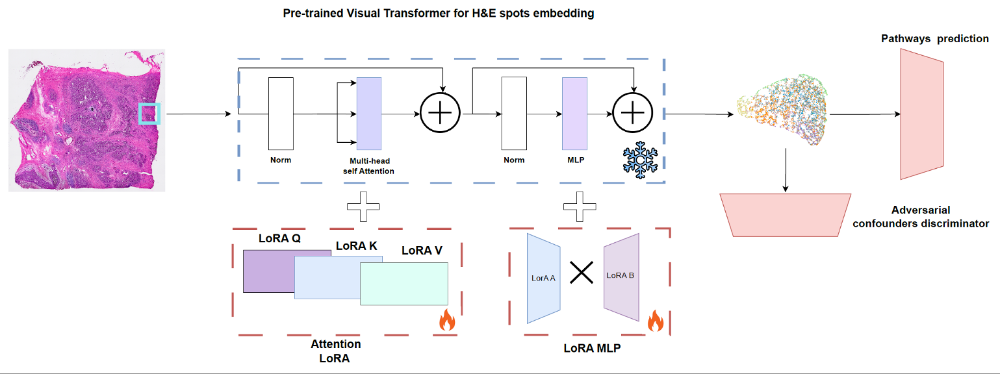

# PATH: Pathway acTivation from Histology Enables Spatial Inference of Pathway Activation from H&E Images

PATH is a deep learning framework that predicts pathway activation directly from H&E-stained histology images in spatial transcriptomics data. The model leverages vision transformers (CTransPath) to extract meaningful embeddings from tissue images and predicts KEGG pathway activities for each spatial spot.



## Features

- **Image-to-Pathway Prediction**: Directly infer pathway activation from H&E histology images
- **Spatial Analysis**: Extract embeddings for spatial clustering and domain identification
- **LoRA Fine-tuning**: Efficient model adaptation using Low-Rank Adaptation (LoRA)
- **Downstream Analysis**: Built-in tools for pathway enrichment and differential pathway activity analysis

## Quick Start

For a complete walkthrough, see the **[PATH Tutorial](./PATH_Toturial.ipynb)** notebook, which demonstrates:

1. Environment setup and dependency installation
2. Data and model weight retrieval
3. Loading and preprocessing spatial transcriptomics data (.h5ad format)
4. Model initialization and inference
5. Embedding extraction and spatial clustering
6. Pathway activity prediction and visualization
7. Differential pathway analysis between spatial domains

## Installation

1. Clone the repository:
```bash
git clone https://github.com/madilabcode/PATH.git
cd PATH
```

2. Set up TransPath dependencies:
```bash
chmod +x clone_transpath.sh
./clone_transpath.sh
```

3. Install required Python packages:
```bash
pip install scanpy torch timm gdown pandas numpy scipy scikit-learn seaborn matplotlib
```

## Repository Structure

- `src/PATH.py` - Main PATH model implementation with LoRA support
- `src/Datasets.py` - Data loading utilities
- `src/Loss.py` - Loss functions for training
- `scripts/Utils.py` - Utility functions for data processing and embedding extraction
- `scripts/anaylsis.py` - Pathway enrichment and differential analysis tools
- `scripts/pathway_enrichment.py` - Pathway enrichment analysis functions
- `PATH_Toturial.ipynb` - Complete tutorial notebook

## Model Architecture

PATH uses a vision transformer backbone (CTransPath) pre-trained on histopathology images, fine-tuned with LoRA for efficient adaptation. The model extracts image embeddings and predicts pathway activities through a KEGG pathway head, enabling spatial inference of biological pathway activation patterns.

## Citation

If you use PATH in your research, please cite:


## License

This project is licensed under the GPL-3.0 License.

